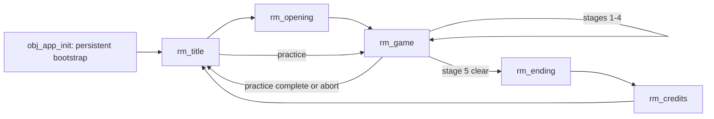

# Architecture and Task Routing

This guide maps runtime ownership and directs a task to the smallest useful
source scope. Function behavior belongs in project-owned `/// @func` contracts;
gameplay detail belongs in [`GAMEPLAY_SYSTEMS.md`](GAMEPLAY_SYSTEMS.md), and data
shapes belong in [`DATA_FORMATS.md`](DATA_FORMATS.md).

## Task routing

| Task | Read | Primary source owners | Focused validation |
| --- | --- | --- | --- |
| Boot, save/config, migration, display | [Data formats](DATA_FORMATS.md#persistence-json) | `scripts/scr_setup`, `obj_app_init` | `test_bootstrap`: Game setup and persistence |
| Input, remapping, title, practice setup | [Input](GAMEPLAY_SYSTEMS.md#input), [pause/practice](GAMEPLAY_SYSTEMS.md#pause-and-practice) | `scripts/scr_input_helpers`, `scripts/scr_title_helpers`, `obj_input_manager`, `obj_UI_title` | controller, title, pause, practice tests |
| Run flow, rank, weapons, enemies, pickups | [Gameplay systems](GAMEPLAY_SYSTEMS.md) | `scripts/scr_gameplay_helpers`, `obj_scene_manager`, player/enemy/bullet objects | gameplay, practice, and rank tests |
| Boss plans or patterns | [Bosses](GAMEPLAY_SYSTEMS.md#bosses), [phase schema](DATA_FORMATS.md#boss-phase-descriptors) | `scripts/scr_gameplay_helpers`, `scripts/scr_boss_patterns`, `obj_boss_parent`, `obj_boss_sunset` | boss-plan, phase, interpreter, and encounter tests |
| Story or dialogue data | [Story JSON](DATA_FORMATS.md#story-json) | `scripts/scr_story_helpers`, `obj_UI_story`, `datafiles/` | story UI and Included File tests |
| Audio routing or production | [Audio direction](AUDIO_DIRECTION.md), [asset pipelines](ASSET_PIPELINES.md#audio) | `scripts/scr_audio_helpers`, `sounds/`, audio tools and manifests | audio routing tests plus score/SFX validators |
| 3D stages, generated art, portraits | [Asset pipelines](ASSET_PIPELINES.md) | `scripts/scr_stage_3d`, `obj_scene_manager`, named `tools/` generator and matching `art/` source manifest | deterministic generator check and visual QA |
| Tests, CI, local playtest | [Validation](VALIDATION.md) | `scripts/test_bootstrap`, `scripts/scr_test_helpers`, test tools, `.github/workflows/` | the selected validation tier itself |
| Governance or documentation | [Project state](PROJECT_STATE.md), this guide | `AGENTS.md`, `docs/`, `tools/check_governance.py` | governance check and Markdown/path review |

Paths in the table are relative to
`Selkie's Moon ~ until we meet again ~/` unless they begin at repository root.
Search within the routed owner before expanding scope.

## Runtime flow

`obj_app_init` and `obj_input_manager` persist across rooms. Room-owned
controllers and UI are recreated with their rooms. The bootstrap owns
initialization, music synchronization, automated-test shutdown, and the visual
tour.

## Shared state

| Global | Owner | Contract |
| --- | --- | --- |
| `global.game_config` | `scr_setup` | display, frame rate, audio gains, and keyboard/gamepad bindings |
| `global.game_save` | `scr_setup` | per-ship score rows, starts, finishes, and continues |
| `global.game_runtime` | `scr_setup`, `scr_gameplay_helpers` | current run, stage, resources, rank, overlays, practice, and story request |
| `global.game_input` | `obj_input_manager`, `scr_input_helpers` | device-neutral movement and verb edges |
| `global.game_audio` | `scr_audio_helpers` | room music, Music Room preview, and one-shot cycling |

`GameRuntimeDataCreateDefault()` is the runtime schema. Add runtime fields there
first; `GameRuntimeGameplayEnsure()` fills missing fields without replacing live
values. Persisted changes additionally require versioning, validation,
migration, and tests.

## Script ownership

| Script | Responsibility |
| --- | --- |
| `scr_setup` | schemas, defaults, persistence, display application, and boot |
| `scr_input_helpers` | bindings, device snapshots, input verbs, remapping, and menu motion |
| `scr_audio_helpers` | music routing, preview ownership, gains, and named SFX entry points |
| `scr_gameplay_helpers` | constants, run/practice/pause/rank, stages, players, encounters, pickups, and enemies |
| `scr_boss_patterns` | boss descriptor interpretation and bullet primitives |
| `scr_story_helpers` | story loading/state, text layout, portraits/backgrounds, and story UI primitives |
| `scr_stage_3d` | stage buffers, camera paths, lighting/fog, and atmosphere |
| `scr_title_helpers` | title pages, character/practice/music state, and drawing |
| `scr_ui_crystal` | clean-backdrop capture, GUI mapping, and crystal-pane shaders |
| `scr_test_helpers` | automation isolation and the visual tour |
| `test_bootstrap` | project GMTL regression suite |
| `GMTL_*` | vendored test library; not project-owned refactor scope |

Object events should coordinate these modules rather than duplicate their
rules.

## Object ownership

### Application and UI

- `obj_app_init`: persistent lifecycle and ownership of the 640x360 GUI and
  crystal-backdrop surfaces.
- `obj_input_manager`: persistent input polling in Begin Step.
- `obj_UI_title`: title state and drawing through `scr_title_helpers`.
- `obj_UI_story`: local story queue and post-dialogue transitions.
- `obj_UI_gameplay`: HUD, notices, boss segments, and continue overlay.
- `obj_UI_menu`: pause navigation; resume is deferred to End Step so the frozen
  frame is consistent.
- `obj_UI_credits`: final-result cache, credits, then runtime reset.

### Gameplay

- `obj_scene_manager`: camera, stage-mode state machine, wave director boundary,
  boss seams, and isolated 3D rendering in Draw Begin.
- `obj_player`: local action state and player rendering; shared resources remain
  in `global.game_runtime`.
- `obj_player_shot`: normalized shot specification, collision, and rendering.
- `obj_enemy_parent`: freeze, damage, defeat rewards, and default movement.
- `obj_enemy_variant`: stage-authored identity, movement role, and attack family.
- `obj_bullet_parent`: freeze, bomb/sword cancellation, medal conversion, motion,
  and culling; bullet children specialize after inherited guards.
- `obj_boss_parent`: phase transitions, HP, destruction, score, and completion.
- `obj_boss_sunset`: encounter identity, camera-relative placement, and pattern
  delegation.
- `obj_powerup`, `obj_medal`: movement, collection, and rewards.

Combat child Step events that call `event_inherited()` must immediately stop
when the parent sets `combat_step_blocked`. That guard preserves pause,
destruction, cancellation, and defeat ordering.

## Stage and encounter boundaries

`GameStageDirectorStep()` is the only live wave source. It reads the roster from
`GameStageEnemyRosterCreate()` and stops at the scrolling boundary; the legacy
GameMaker timeline stays idle. `obj_scene_manager` owns the transition through
`scroll`, `boss_intro`, `boss_fight`, `boss_outro`, and `stage_clear`.

Boss construction and execution are deliberately separate:

1. `GameBossEncounterInfoCreate()` selects identity and constructs `phase_plan`.
2. `GameBossPhaseAttackStep()` interprets the active descriptor through
   `scr_boss_patterns`.

Stage 3 additionally coordinates two personal boss objects and one synchronized
shared finale. Unknown or empty descriptors fail closed and log a warning. The
phase counts, motifs, and flow are described once in
[`GAMEPLAY_SYSTEMS.md#bosses`](GAMEPLAY_SYSTEMS.md#bosses).

## Persistence boundary

`game.sav` and `config.sav` are JSON payloads in GameMaker's save sandbox.
Loading parses defensively, rejects and backs up future versions, migrates known
older fields into defaults, and rewrites only after normalization. Automated
runs use `automation-` filenames so tests do not touch player data.

## Extension checklist

- Persistent field: default, version, validator, migration, and tests.
- Runtime-only field: runtime default, compatibility ensure, and tests.
- Input action: verb list, default bindings, state, device snapshots, labels,
  application, persistence migration, and tests.
- Stage enemy: roster/specification, spawn behavior, inherited stop contract,
  and tests.
- Boss pattern: descriptor seed, family interpreter case, uniqueness/signature
  tests, and no fallback attack.
- Story asset: follow `DATA_FORMATS.md` and register it under `IncludedFiles`.
- New resource of any kind: implementation/binary, matching `.yy`, and `.yyp`
  registration.
